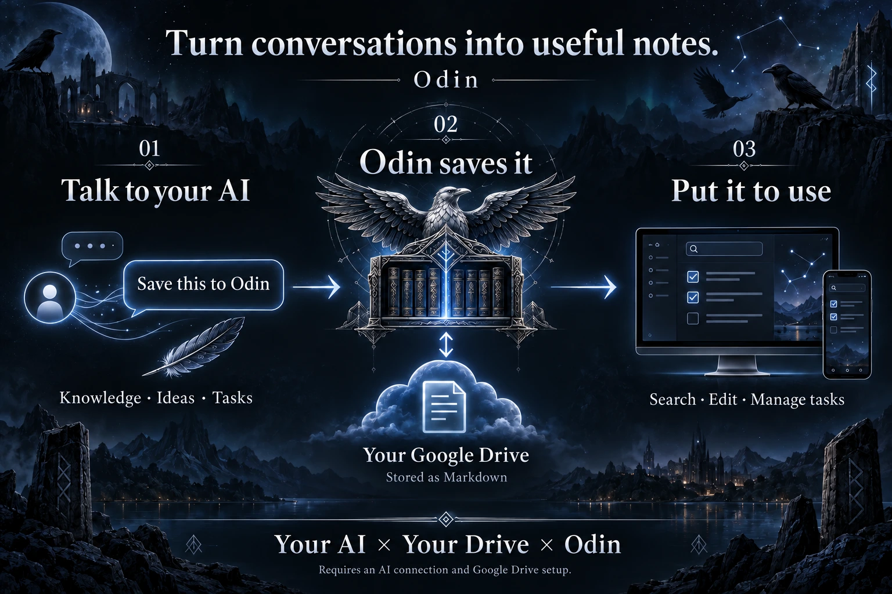

<p align="center"><a href="README.md">日本語</a> | <strong>English</strong></p>

<p align="center"></p>

<h1 align="center">Odin — Personal knowledge and tasks, connected to your AI</h1>

<p align="center">Save knowledge, ideas, and tasks from AI conversations to your own Google Drive.<br />Search, edit, and manage them from your computer or phone.</p>

<p align="center"><a href="#how-it-works">How it works</a> · <a href="#try-it-locally">Try it locally</a> · <a href="#connect-drive-and-your-ai">Connect Drive and your AI</a></p>


## How it works



> Tell your AI, “Save this to Odin.” Pick it up later on your phone.

Your connected AI organizes the content and saves it to Drive through Odin. The creator uses this workflow while talking with GPT Live to capture notes and tasks.

| Ask your AI | Use it in Odin |
| --- | --- |
| “Summarize what we found and save it.” | Search and edit the key points and sources later |
| “Add what we just agreed to my tasks.” | See what needs doing and check it off |
| “Keep this idea for later.” | Organize it alongside related notes and projects |

You need to connect your AI and Google Drive first. Plugin and voice-mode availability depends on the product and your account.

<p align="center"> </p>

## Features

- **Keep things together** — Knowledge, tasks, shopping lists, ideas, and projects. You can also add records directly in the app.
- **Find and edit** — Text and tag search, Markdown editing, sources, and related records.
- **Explore connections** — Follow related notes and project records in the Knowledge Map.
- **Get things done** — See unfinished tasks and shopping items on the home screen. Checklists inside notes work too.
- **Export and recover** — Revision history, trash recovery, and ZIP export of Markdown records and history.
- **Organize past conversations** — Import conversation exports and review suggestions prepared by an external AI before saving.
- **Choose your language** — Switch between Japanese and English. Your own notes, titles, and tags stay as written.

<details>
<summary>See the knowledge map and record details</summary>


<p align="center"></p>

</details>

Screenshots show the Japanese interface with fictional sample records. You can switch the app to English. The screenshot data differs from the examples included on first launch; the workflow diagram is an illustration.

## Why I built it

Copying useful AI conversations into a notes app every time was a chore. I found Obsidian's AI integrations hard to navigate and didn't want another subscription. So I built Odin to **let my usual AI organize things, save them to the Google Drive I already use, and manage them in an interface I enjoy.**

The name comes from the Norse god Odin and his ravens, Hugin (“thought”) and Munin (“memory”). If I'm opening a tool every day, I want to enjoy it. **The design goes all in on dramatic dark fantasy. Unapologetically.** You can turn off the background animation.

## Try it locally

Install **Node.js 24 or later and npm**, then download or clone this repository. From its directory, run:

```sh
npm ci
npm run dev
```

Open [http://127.0.0.1:3000](http://127.0.0.1:3000) to try the sample records **without setting up Drive or an AI connection**. The app starts in Japanese: open Settings (設定) and select **English**. Add a note or check off a task.

The language choice is remembered in this browser. Records are stored locally as Markdown in `.odin/vault` by default. This directory is excluded from Git, so back it up separately.

## Connect Drive and your AI

Odin is an app you run and host yourself. To save directly from conversations, follow these steps:

| Step | What to set up | Guide |
| --- | --- | --- |
| **1. Connect Drive** | Enable the Drive API, configure Google OAuth, and run `npm run setup:drive` | [Drive setup and migration](docs/SETUP.en.md#use-google-drive-for-storage) |
| **2. Host it if needed** | Make Odin available over HTTPS for ChatGPT or access away from your computer | [Hosting, authentication, and shared locking](docs/SETUP.en.md#use-odin-over-the-internet) |
| **3. Connect your AI** | Register Odin with ChatGPT or a compatible MCP client such as Codex | [Generate and install the plugin](docs/PLUGIN-SETUP.en.md) |

A plugin template is included. Run `npm run setup:plugin -- --language en` to generate your own plugin and ZIP with English instructions. [Follow the setup guide](docs/PLUGIN-SETUP.en.md).

You must connect **Odin itself**, separately from ChatGPT's Google Drive integration. The guides cover OAuth for ChatGPT, Codex configuration, and troubleshooting.

## Before you start

- Odin has no built-in AI API calls for classification or summarization. Costs depend on your AI plan, Drive storage, hosting, and supporting services.
- It is for personal use. Collaboration, scheduled notifications, and automatic synchronization of all AI conversation history are not included.
- Once connected, Drive becomes the storage location. It does not automatically sync both ways with your local records.

---

This repository is still a private release-preparation build. Code and image licensing and redistribution terms have not been finalized. [Release status](docs/RELEASE-STATUS.en.md) · [Image provenance (Japanese)](docs/ASSETS.md)
