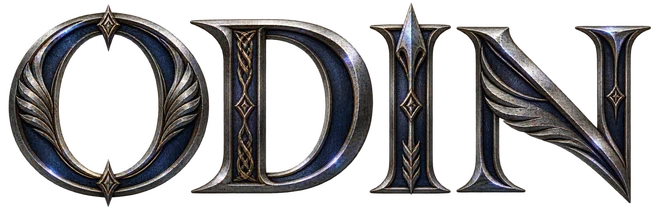
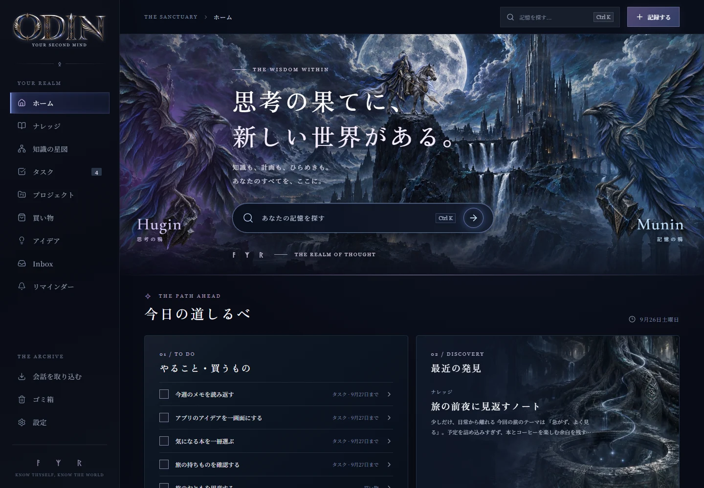
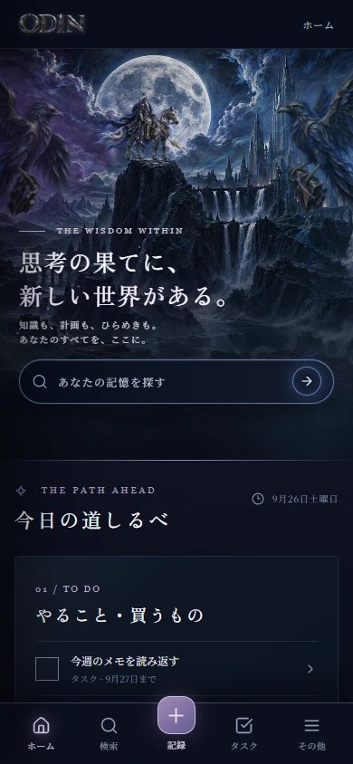
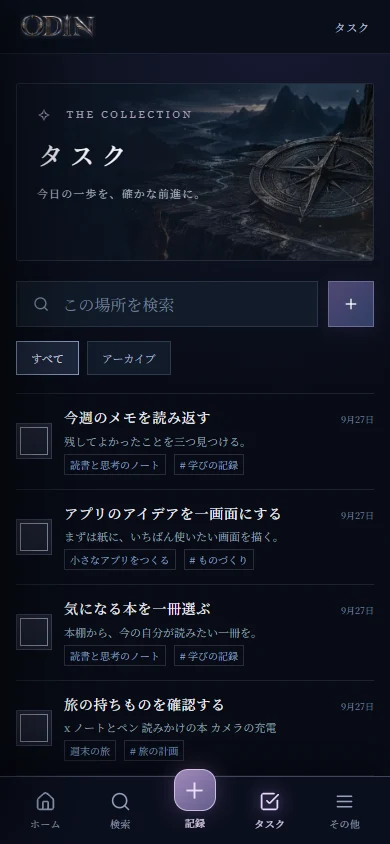
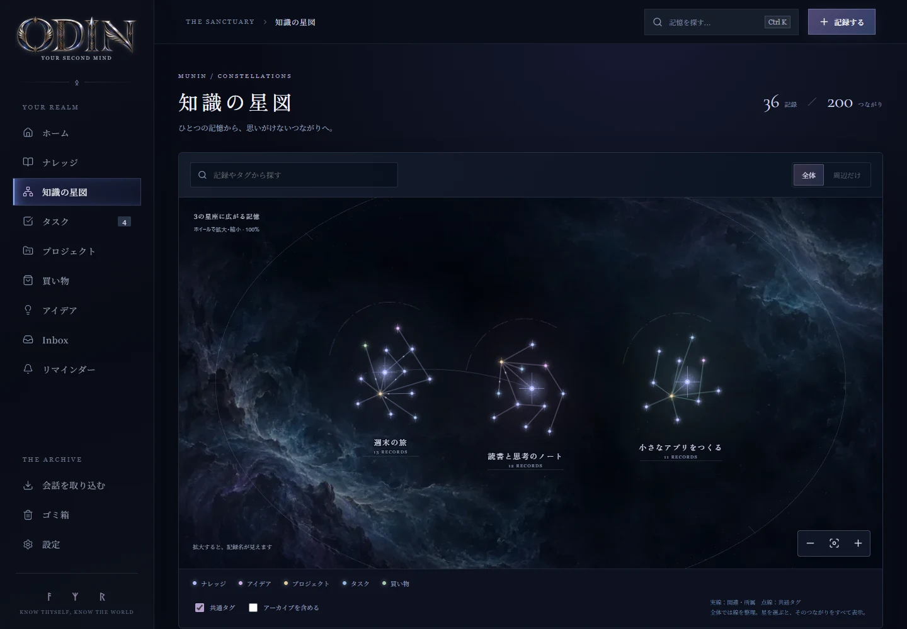
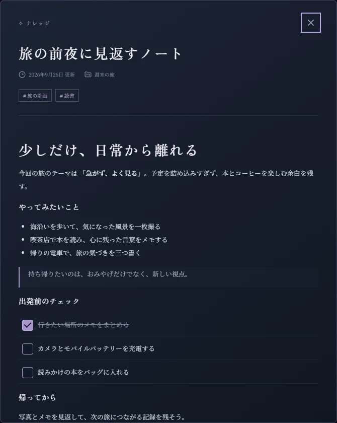

<p align="center"></p>

<h1 align="center">Odin — 個人用のナレッジ・タスク管理アプリ</h1>

<p align="center">AIとの会話で出てきたメモやタスクを、Google Driveに保存。<br />Odinで一覧・検索・編集し、記録どうしの関係もグラフで確認できます。</p>

<p align="center"><sub>公開準備中 · 掲載画面の記録はサンプルデータです</sub></p>

<p align="center"><a href="#記録の関係をグラフで表示">知識の星図を見る</a> · <a href="#ローカルで試す">ローカルで試す</a> · <a href="docs/SETUP.md">セットアップガイド</a></p>

## なぜ作ったのか

AIと話していると、残しておきたい話やアイデア、あとでやるべきことが出てきます。それを毎回別のアプリにコピーして整理するのは面倒でした。

Obsidianも気になっていましたが、自分にはAIとの連携方法がすぐには分かりませんでした。プラグインでできることを調べるうちに、「自分が普段使っているAIとの会話に合うものを、自分で作ってみたい」と思うようになりました。

知識を保存するために新しいサブスクを増やすのも避けたい。そこで、すでに使っているGoogle Driveを記録の保管場所にして、それを見たり管理したりするアプリとして作ったのがOdinです。

## GPT Liveで「Odinに渡しといて」

作っていて特に便利だと感じているのが、普段使っているGPT Liveとの組み合わせです。作者の接続済み環境では、会話の途中でこんなふうに頼んで使っています。

> 「さっき話したこと、Odinに渡しといて」
>
> 「それ、あとでやるからOdinにタスクとして入れといて」

会話から残したい内容をAIに整理してもらい、Odin経由でGoogle Driveへ保存する。あとでOdinを開くと、保存した内容を読んだり、タスクを確認して完了にしたりできます。会話のたびに自分でメモを転記しなくても、必要な内容を蓄積していけるところが気に入っています。

| 役割 | 使うもの |
| --- | --- |
| 話す・内容を整理して保存を依頼する | 普段使っているAI |
| 記録を保管する | Google Drive（Markdownファイル） |
| 見返す・検索する・タスクを管理する | Odin |

この使い方には、DriveとAI側の接続設定が必要です。利用できる接続方法はAI製品・音声モード・アカウントによって異なります。OdinはREST APIとMCPを備えており、設定と読み書きの確認手順は[AI接続ガイド](docs/AI-CONNECTIONS.md)にまとめています。

## Odinでできること



北欧神話をモチーフにしたダークテーマのUIで、PC・スマートフォンに対応しています。背景の光や霧のアニメーションは設定からオフにでき、端末の「動きを減らす」設定にも対応しています。

## メモとタスクをまとめて管理

「記録する」から、ナレッジ、アイデア、Inbox、プロジェクト、タスク、リマインダー、買い物を登録できます。読書メモに出典を付ける、アイデアをプロジェクトにまとめるなど、用途に合わせて整理できます。タグや関連する記録も設定できます。

ホームの「**今日の道しるべ**」には、未完了のやること・買うものを集約。期限の近いものから確かめ、詳細を開いたり、その場で完了したりできます。長いタスクの本文に書いた項目も、ひとつずつチェックできます。

<p align="center"> </p>

## 記録の関係をグラフで表示

「**知識の星図**」は、記録どうしの関係を表示するグラフです。関連づけた記録や同じプロジェクトに属する記録が線でつながり、共通タグの関係も表示できます。記録を選ぶと関連する記録を確認でき、そのまま本文を開けます。



記録の詳細画面では、Markdownの本文、出典、タグ、関連する記録を確認・編集できます。検索や変更履歴からの復元にも対応しています。

<p align="center"></p>

## 過去の会話もファイルから取り込める

ChatGPT・Claude・Geminiの書き出しファイルや、このPCのCodex履歴から、期間と会話を選んで取り込めます。普段使う**外部AI**で知識候補を作る場合は、元の発言という根拠と候補の内容をOdinで確認してから保存します。原文をもとに下書きする使い方もできます。Odin自体に分類・要約用のAI APIは内蔵していません。詳しくは[AI接続ガイド](docs/AI-CONNECTIONS.md)をご覧ください。

## ローカルで試す

Node.js **24以上**とnpmを用意してください。外部サービスの認証情報なしで試せます。

リポジトリを取得したら、フォルダー内で次の2コマンドを実行します。

```sh
npm ci
npm run dev
```

1. ブラウザーで `http://127.0.0.1:3000` を開きます。初回はサンプル記録で操作を試せます。
2. 「記録する」からメモやタスクを作成し、タグや関連する記録を設定します。
3. 「知識の星図」で記録を選択し、関連する記録や本文を確認します。

掲載画面の「週末の旅」など36件の記録は撮影専用です。初回起動時のサンプルとは異なります。

標準では記録の**Markdownファイルが正本**となり、`.odin/vault` に保存されます。記録と変更履歴はZIPで書き出せます。保管庫はGit管理外なので、使い続ける場合はバックアップしてください。サンプル記録が不要なら、初回起動前に `.env.example` を `.env.local` にコピーして `ODIN_SEED_EXAMPLES=0` にします。

冒頭で紹介した使い方を試すには、自分のGoogle CloudプロジェクトとOAuth認証情報を設定して、保存先をGoogle Driveへ切り替え、外部AIを接続します。Driveは自動の双方向同期ではありません。手順は[セットアップガイド](docs/SETUP.md)と[AI接続ガイド](docs/AI-CONNECTIONS.md)にまとめています。

Odinには分類・要約用のAI API呼び出しを内蔵していません。費用は利用するAIの契約、Driveの容量、ホスティングなどの構成によります。

---

このリポジトリは現在、非公開の準備版です。ライセンスと画像素材の再配布条件は未確定で、再利用許諾はまだ設定していません。進捗と確認事項は[公開準備の状態](docs/RELEASE-STATUS.md)をご覧ください。

[生成素材について](docs/ASSETS.md) · [AIとの接続](docs/AI-CONNECTIONS.md)
