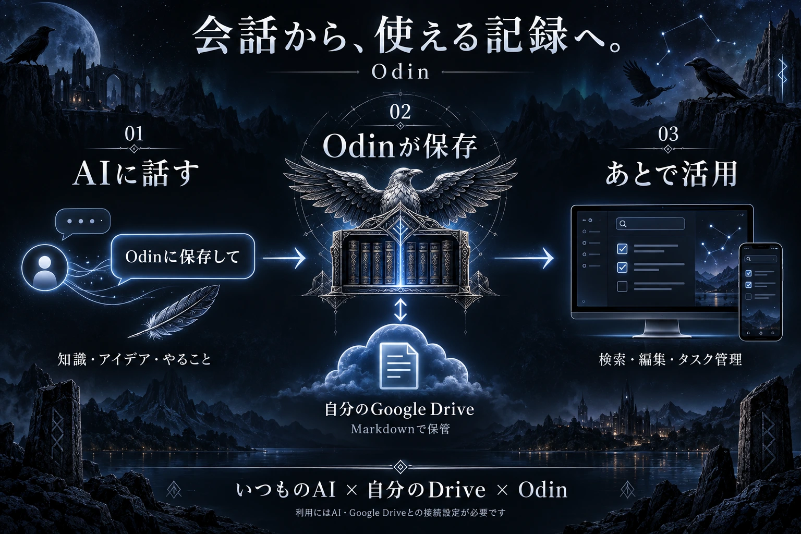

<p align="center"><strong>日本語</strong> | <a href="README.en.md">English</a></p>

<p align="center"></p>

<h1 align="center">Odin — GPT Liveの会話から記録・タスク・買い物リストへ</h1>

<p align="center">GPT Liveで話した内容を、メモやタスク、買い物リストとして自分のGoogle Driveへ。<br />PC・スマホから検索・編集できます。</p>

<p align="center"><a href="#使い方の例">使い方</a> · <a href="#まずは試す">まずは試す</a> · <a href="#driveaiのセットアップ">Drive・AIの設定</a></p>


## 使い方の例



> GPT Liveで「今の話、Odinに保存しといて」→ あとでスマホから確認。

作者はGPT Liveでの会話を途切れさせずに、話した内容やタスク、買い物リストをOdinへ残すために使っています。接続したAIが内容を整理し、Odinを通じてDriveへ保存します。

| GPT Liveでの依頼例 | Odinで使う |
| --- | --- |
| 「調べた内容をまとめて保存して」 | 要点や出典をあとから検索・編集 |
| 「今決めたことをタスクに入れて」 | やることを確認し、終わったらチェック |
| 「牛乳と卵を買い物リストに入れて」 | 買うものを確認し、購入後にチェック |

**Claude・Claude Code・Codexにも広がる使い方。** Claude・Claude Code・CodexなどのMCP対応環境にも接続できる設計です。会話の要点や開発中に決めたことを残し、同じOdinでまとめて管理する使い方にも応用できます。[接続方法](docs/AI-CONNECTIONS.md#ほかのaiと共通の操作)

AIとDriveへの接続設定が必要です。音声中のツール利用は製品・アカウント・モードによって異なります。作者の音声での利用経験はGPT Liveで、他クライアントとの実接続は個別に確認してください。

<p align="center"> </p>

## 主な機能

- **表示言語を選ぶ** — 日本語・Englishを切り替えられます。記録の本文・タイトル・タグはそのまま保持。

- **記録をまとめる** — 知識、タスク、買い物、アイデア、プロジェクトを管理。画面から直接入力もできます。
- **探す・編集する** — 文字・タグ検索、Markdown編集、出典や関連記録の保存。
- **つながりを見る** — 「知識の星図」で、関連する記録や同じプロジェクトの記録をたどれます。
- **やることを進める** — ホームに未完了のタスクや買い物を表示。本文のチェックリストにも対応。
- **記録を持ち出す・戻す** — 変更履歴、ゴミ箱からの復元、Markdownと履歴のZIP書き出し。
- **過去の会話を整理する** — AI会話の書き出しファイルなどから取り込み、外部AIがまとめた保存候補を確認して反映。

<details>
<summary>知識の星図・記録の詳細画面を見る</summary>


<p align="center"></p>

</details>

画面写真は日本語表示のサンプルデータです。初回起動時のサンプルとは内容が異なります。

## 作った理由

GPT Liveで気軽に話しながら、その会話内容やタスク、買い物リストをそのまま作りたかった。毎回メモアプリへ転記するのは面倒で、ObsidianとのAI連携も自分には分かりにくい。新しいサブスクを増やさず、**GPT Liveで整理した内容を手持ちのGoogle Driveへ保存し、自分好みの画面で管理する**ために作りました。

名前は「思考」の鴉Hugin（フギン）と「記憶」の鴉Munin（ムニン）を従える、北欧神話のオーディンから。毎日開くなら気分が上がるものを、ということで、**デザインは厨二病全開です。悪しからず。** 背景のアニメーションはオフにもできます。

## まずは試す

**Node.js 24以上とnpm**を用意し、リポジトリをダウンロードまたはクローン。そのフォルダーで実行します。

```sh
npm ci
npm run dev
```

[http://127.0.0.1:3000](http://127.0.0.1:3000) を開けば、**Drive・AIの設定なしで**サンプル記録を試せます。「記録する」からメモを作ったり、タスクをチェックしたりしてみてください。

表示言語は設定画面などで切り替えられ、ブラウザーごとに記憶します。

初期状態ではPC内の `.odin/vault` にMarkdownで保存します。このフォルダーはGit管理外なので、バックアップは別途取ってください。

## Drive・AIのセットアップ

Odinは自分で起動・運用するアプリです。会話や作業中に保存できるよう、次の順で設定します。

| 手順 | 設定すること | 詳しい手順 |
| --- | --- | --- |
| **1. Driveを接続** | Google CloudでDrive API・OAuthを設定し、`npm run setup:drive` を実行 | [Driveの設定・既存記録の移行](docs/SETUP.md#google-driveを保存先にする) |
| **2. 必要ならホスト** | 外出先のスマホやChatGPTから使うため、HTTPSでアクセスできる場所へ配置 | [Vercel・認証・共有ロックの設定](docs/SETUP.md#インターネット上で使う場合) |
| **3. AIに登録** | ChatGPTのプラグイン、またはCodexなどのMCP接続としてOdinを登録 | [プラグインの生成・導入](docs/PLUGIN-SETUP.md) |

配布用テンプレートを同梱しています。`npm run setup:plugin` で、自分用の接続設定を含むプラグインとZIPを生成できます。[導入手順はこちら](docs/PLUGIN-SETUP.md)。

ChatGPTのGoogle Drive連携とは別に、**Odin自身への接続**が必要です。ChatGPT用のOAuth設定、Codexの設定例、接続できないときの確認項目は上記ガイドにまとめています。

## 利用前に

- Odinには分類・要約用のAI API呼び出しを内蔵していません。AIの契約、Drive容量、ホスティングなどの費用は構成によります。
- 1人のオーナーが使う設計です。共同編集、時刻指定の通知、AI会話の全履歴の自動同期はありません。
- Drive接続後はDriveが保存先になります。PC内の記録との自動双方向同期ではありません。

## 自由に使って、感想も聞かせてください

[MITライセンス](LICENSE)で公開しています。個人利用・商用利用・改造・再配布も自由です。著作権表示とライセンス文は残してください。

バグ報告や使ってみた感想、「こうしたら便利になった！」という改善も、GitHubのIssuesやPull Requestでぜひ教えてください。作者が喜びます。**報告は任意です。気軽に使ってもらえたら嬉しいです。**

コード・文書・プラグインと、作者が権利を持つ同梱画像に適用します。依存ライブラリや第三者の権利はそれぞれの条件に従います。

[公開状況](docs/RELEASE-STATUS.md) · [画像素材について](docs/ASSETS.md)
